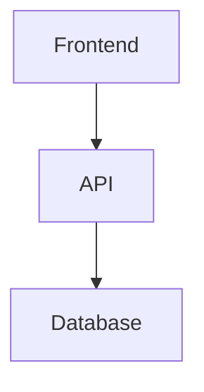

# Markdown Demo

Đây là đoạn văn bản bình thường.

Lorem ipsum dolor sit amet, consectetur adipiscing elit.

---

# Heading Levels

# Heading 1

## Heading 2

### Heading 3

#### Heading 4

##### Heading 5

###### Heading 6

---

# Text Formatting

**Bold text**

*Italic text*

***Bold + Italic***

~~Strikethrough~~

==Highlight==

Inline code: `const a = 1`

Subscript: H~2~O

Superscript: X^2^

Escape character:

\# Not heading

---

# Quote

> Đây là blockquote
>
> Có thể nhiều dòng
>
>> Nested quote

---

# List

## Unordered List

- Apple
- Banana
- Orange

### Nested List

- Frontend
  - Vue
  - React
  - Angular
- Backend
  - NestJS
  - Express

---

## Ordered List

1. Step 1
2. Step 2
3. Step 3

---

## Task List

- [x] Completed task
- [ ] Pending task
- [ ] Another task

---

# Link

## Normal Link

[Google](https://google.com)

## Auto Link

https://github.com

## Anchor Link

[Jump to table](#table)

---

# Image

## Normal Image


## Image With Title


---

# Table

| Name | Age | Role |
|---|---|---|
| Duy | 32 | Developer |
| Anna | 28 | Designer |
| John | 40 | Manager |

---

# Code Block

## TypeScript

```ts
interface User {
  id: string
  name: string
}

const user: User = {
  id: '1',
  name: 'Duy',
}

console.log(user)
```

---

## JavaScript

```js
function sum(a, b) {
  return a + b
}
```

---

## Bash

```bash
npm install remark remark-html
```

---

## JSON

```json
{
  "name": "markdown-demo",
  "version": "1.0.0"
}
```

---

## HTML

```html
<div class="container">
  Hello World
</div>
```

---

# Horizontal Rule

---

# Footnote

This is a footnote example[^1]

[^1]: Đây là nội dung footnote

---

# Emoji

😀 🚀 🔥 ❤️

---

# HTML Inside Markdown

<div style="padding:16px;border:1px solid #ccc">
  Raw HTML block
</div>

<span style="color:red">
  Inline HTML
</span>

---

# Details / Summary

<details>
  <summary>Click to expand</summary>

  Hidden content here

</details>

---

# Keyboard Key

Press <kbd>Ctrl</kbd> + <kbd>C</kbd>

---

# Definition List

Markdown
: Lightweight markup language

HTML
: HyperText Markup Language

---

# Mermaid Diagram



---

# Math Formula

Inline math:

$E = mc^2$

Block math:

$$
\frac{d}{dx}(x^2) = 2x
$$

---

# Deep Nested Structure

- Level 1
  - Level 2
    - Level 3
      - Level 4

---

# Long Paragraph

Lorem ipsum dolor sit amet, consectetur adipiscing elit. Sed do eiusmod tempor incididunt ut labore et dolore magna aliqua. Ut enim ad minim veniam.

---

# Callout Style

> [!NOTE]
> Đây là ghi chú

> [!WARNING]
> Đây là cảnh báo

> [!TIP]
> Đây là mẹo

---

# Mixed Content

1. Item with code

   ```ts
   const hello = 'world'
   ```

2. Item with table

   | A | B |
   |---|---|
   | 1 | 2 |

3. Item with image

   

---

# TOC Test

## Section A

### Section A.1

### Section A.2

## Section B

### Section B.1

#### Section B.1.1

---

# XSS Test

<script>
  alert('xss')
</script>


---

# Final Section

The end.